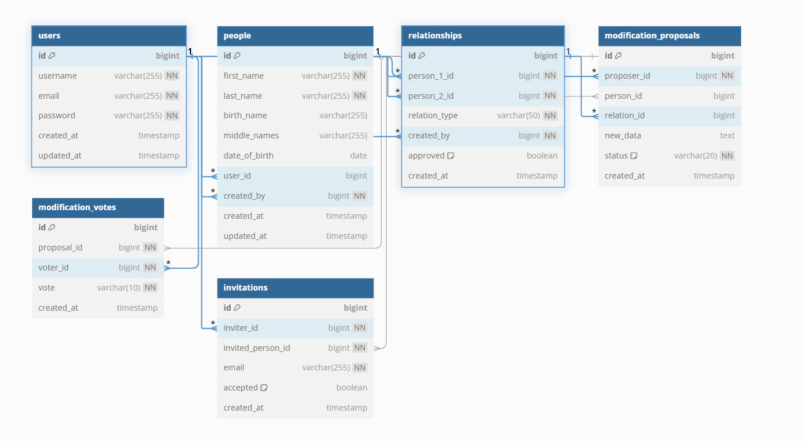

1. Lorsqu'un utilisateur propose une modification, une nouvelle entrée est insérée dans la table modification_proposals avec le statut "pending" et les données proposées stockées en JSON.

2. Chaque vote (acceptation ou refus) est enregistré dans la table modification_votes avec l'ID de la proposition et l'ID du votant.

3. Lorsque trois votes "accept" sont atteints, la proposition est mise à jour dans modification_proposals pour avoir le statut "approved".

4. Si la proposition concerne une fiche personne, les informations de la table people sont mises à jour.
- Si elle concerne une relation, un nouvel enregistrement est inséré dans la table relationships avec le champ "approved" mis à TRUE.
- Si trois votes "reject" sont enregistrés, la proposition est mise à jour pour avoir le statut "rejected" et aucune modification n'est appliquée.